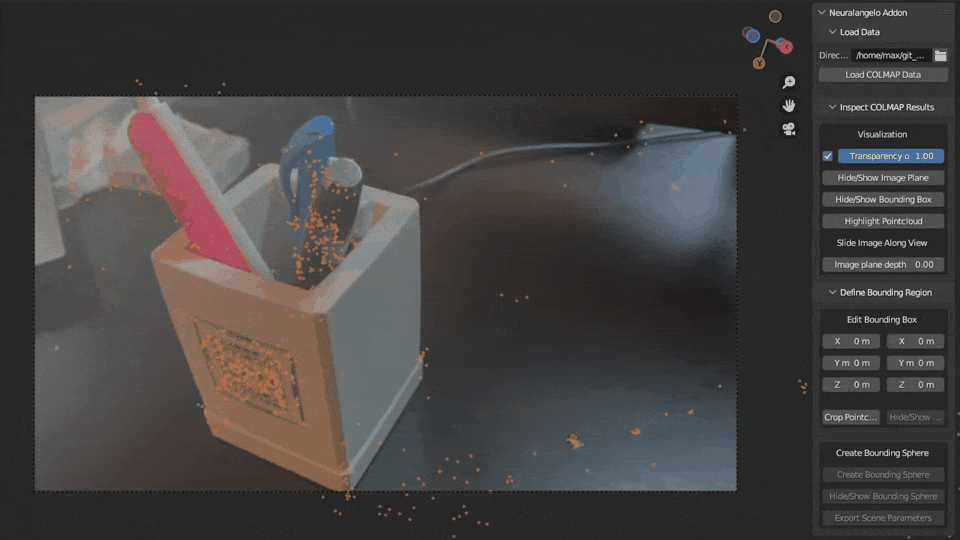

<div align="center">

# BlenderNeuralangelo

</div>



[Blender](https://www.blender.org/) addon to inspect and preprocess COLMAP data
for [Neuralangelo (CVPR 2023)](https://research.nvidia.com/labs/dir/neuralangelo/).
The addon allows you to inspect the COLMAP poses, check the sparse reconstruction overlaid with RGB images, and export
the bounding regions for Neuralangelo.

## Getting Started

First clone the code to a local directory.

```angular2html
cd /path/to/dir
git clone git@github.com:mli0603/BlenderNeuralangelo.git
```

### 0: Running COLMAP

Please follow the [instructions](https://colmap.github.io/cli.html) to obtain COLMAP results. Alternatively, an example
is provided in the folder [toy_example](toy_example).

If COLMAP instructions are followed correctly, a folder structure of the following should be expected:

```angular2html
|__ dense (or your customized work directory)
    |__ images (folder of undistorted images)
    |__ sparse (folder of sparse reconstruction results)
    |__ run-colmap-geometric.sh
    |__ run-colmap-photometric.sh
```

### 1.1: Install as Addon

Installing as a Blender Addon avoids re-installation after quitting blender. To install as an Addon:


### 1.2: Run as code

Alternatively, the code can be directly run as follows:


After quitting Blender, this step must repeat.

### 2: Locating the control panel

After installation, the BlenderNeuralangelo panel can be located on the right side or press `N` on the keyboard.


### 3: Load COLMAP data

COLMAP can be loaded by providing the path to the COLMAP work directory. The images, camera parameters and sparse
reconstruction results are loaded.


### 4: Inspect COLMAP data

COLMAP data can be inspected qualitatively by looking at the RGB, sparse reconstruction and pose results.


### 5: Defining region of interest

A graphics interface is provided to define the region of interest for Neuralangelo as a form of bounding box. Points
outside the region of interest can be cropped.


### 6: Defining bounding sphere

[Neuralangelo](https://research.nvidia.com/labs/dir/neuralangelo/) and prior
works <sup>[1](https://arxiv.org/abs/2003.09852)[2](https://arxiv.org/abs/2106.10689)[3](https://arxiv.org/abs/2106.12052)</sup>
on neural surface reconstruction often assumes a spherical region of interest. This addon generates a bounding sphere
and exports the scene parameters (intrinsics, poses, bounding sphere) following
the [Instant NGP](https://github.com/NVlabs/instant-ngp) format.


